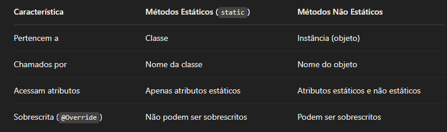
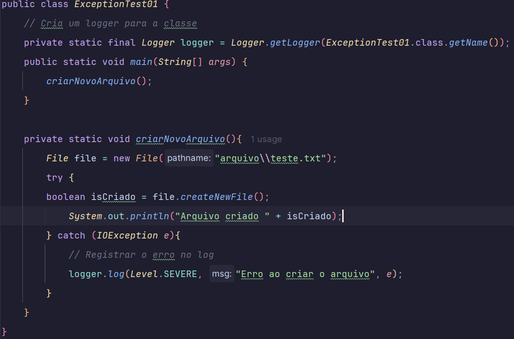

## *Como Java Funciona*
o Java é uma linguagem de programação multiplataforma. Isso significa que ele pode ser escrito para um sistema 
operacional e executado em outro. Como isso é possível? O código Java é escrito primeiro em um Kit de Desenvolvimento 
Java, que está disponível para Windows, Linux e macOS. Os programadores escrevem na linguagem de programação Java, que
o kit traduz em código de computador que pode ser lido por qualquer dispositivo com o software certo. Isso é feito com
um software chamado compilador. Um compilador usa um código de computador de alto nível como Java e o converte em uma
linguagem que os sistemas operacionais entendem chamado código de bytes. O código de bites é então processado por um
interpretador chamado Máquina Virtual Java (JVM). As JVMs estão disponíveis para a maioria das plataformas de software
e hardware, e isso é o que permite que o código Java seja transferido de um dispositivo para outro. Para executar o
Java, os JVMs carregam o código, verificam-no e fornecem um ambiente de runtime.
>https://azure.microsoft.com/pt-br/resources/cloud-computing-dictionary/what-is-java-programming-language

## *Array*
Formas de iniciar um array:  
int[ ] numeros1 = new int[3];  
int[ ] numeros2 = {1,2,3,4,5};  
int[ ] numeros3 = new int [ ] {1,2,3,4,5};  

## *O que é um array em Java?*
É uma estrutura de dados que armazena vários valores do mesmo tipo em uma única variável. O índice do 
primeiro elemento é sempre 0, e o último elemento tem índice tamanho - 1.

### *Percorrendo um array com for*
for (int i = 0; i < numeros.length; i++) {
System.out.println(numeros[i]);  
}

### *Usando for-each para percorrer o array*
for (int num : numeros) {  
System.out.println(num);  
}

## *O que são Arrays Multidimensionais em Java?*
Arrays multidimensionais são estruturas de dados que permitem armazenar elementos organizados em mais de uma dimensão. 
Isso significa que, em vez de ter uma única sequência de elementos (como em um array comum), você pode ter arrays dentro
de arrays.  

A sintaxe para declarar um array bidimensional em Java é:

tipo[ ][ ] nomeDoArray = new tipo [linhas] [colunas];  
int [ ][ ] ArrayMultidimensionais = new int [3][3];

### Cada elemento da matriz pode ser acessado através de dois índices, representando linha e coluna:

matriz[0][0] = 5;  
matriz[2][1] = 10;

## Introdução a Classes e Objetos em Java

### O que são Classes e Objetos?
*Classe:* É um molde que define as características (atributos) e comportamentos (métodos) de um objeto.

*Objeto:* É uma instância de uma classe, ou seja, uma entidade criada a partir da definição de uma classe.

## Coesão entre Métodos e Variáveis
A coesão é um princípio importante em programação orientada a objetos. Em Java, ela significa que os métodos e variáveis de uma classe devem estar fortemente relacionados entre si e com a responsabilidade da classe. Isso ajuda a tornar o código mais organizado e fácil de manter.

### Boas Práticas para Coesão  
Métodos devem ser responsáveis por uma única tarefa
Cada método deve realizar apenas uma tarefa específica, que se reflete nas variáveis que ele manipula.

Evitar atributos ou métodos que não têm relação com a responsabilidade da classe  
A classe Carro, por exemplo, não deve ter métodos ou atributos relacionados a outra coisa que não seja o comportamento ou as características de um carro.

## Referências a Objetos em Java
Em Java, os objetos são manipulados por meio de referências. Uma referência é simplesmente um ponteiro para a memória onde o objeto está armazenado. Vamos explorar como as referências funcionam, como passá-las como parâmetros e como compará-las.

### Como Funcionam as Referências em Java
Quando você cria um objeto, você não está realmente criando o objeto em si, mas sim uma referência para esse objeto. A variável que armazena essa referência não contém o objeto, mas sim o endereço de memória onde ele está alocado.  

Quando criamos carro1, ele referencia um objeto Carro com o modelo "Corolla".

Depois, carro2 é atribuído a carro1, o que significa que ambas as variáveis apontam para o mesmo objeto.

Ao alterar o modelo de carro2, o modelo de carro1 também muda, pois ambos estão se referindo ao mesmo objeto na memória.

### Passagem de Objetos como Parâmetros
Quando você passa um objeto como parâmetro para um método, está passando a referência para esse objeto, não uma cópia dele.

O método alterarModelo() recebe um objeto Carro como parâmetro. Ele altera o atributo modelo do objeto passado como argumento.

Como o objeto é passado por referência, a alteração é refletida no objeto original.

## Definição de Métodos em Java
Métodos em Java são funções que pertencem a uma classe e são usados para definir o comportamento dos objetos dessa classe. Vamos explorar como criar e utilizar métodos, incluindo conceitos como retorno de valores, métodos sem retorno (void), e a sobrecarga de métodos.

### Criando e Utilizando Métodos  
Métodos são definidos dentro de uma classe e podem ser chamados para realizar ações ou retornar valores. Vamos criar um exemplo simples com um método que retorna um valor e outro que não retorna nada.

O método ligar() não tem retorno (é do tipo void) e apenas exibe uma mensagem na tela.

O método obterInformacoes() retorna uma String contendo as informações do carro.

No main, chamamos ambos os métodos, sendo um para imprimir uma mensagem e o outro para capturar o retorno e exibir.

## Sobrecarga de Métodos (Overloading)
Sobrecarga de métodos ocorre quando você cria múltiplos métodos com o mesmo nome, mas com diferentes parâmetros (tipo, número ou ordem de parâmetros). Isso permite que você tenha métodos que realizam ações semelhantes, mas com diferentes entradas.

Criamos dois métodos exibirInfo(), um que exibe apenas a marca e modelo, e outro que exibe também o ano.

Ambos os métodos têm o mesmo nome, mas o parâmetro ano faz a diferença.

## Modificadores de Acesso e Encapsulamento em Java
Os modificadores de acesso em Java controlam a visibilidade de classes, métodos e atributos. Eles são fundamentais para garantir o encapsulamento, que é o princípio de ocultar o estado interno de um objeto e permitir que ele seja acessado e modificado apenas por meio de métodos específicos. Vamos explorar os modificadores de acesso: public, private, protected e o modificador default.

### 1. public  
   O modificador public torna a classe, o método ou o atributo acessível de qualquer lugar, ou seja, em qualquer outra classe, independente de onde ela esteja no código.

### 2. private  
   O modificador private torna o método ou o atributo acessível apenas dentro da própria classe. Nenhuma outra classe pode acessar diretamente esses membros. Isso ajuda a proteger o estado interno do objeto.

### 3. protected  
   O modificador protected permite que o acesso seja feito dentro da própria classe, por subclasses e por outras classes no mesmo pacote. Isso é útil quando você está criando uma hierarquia de classes e deseja permitir o acesso aos membros de uma classe base nas classes derivadas.

### 4. Modificador Default (sem modificador)
   Quando você não especifica nenhum modificador de acesso, o Java considera que o modificador é o default (ou package-private), o que significa que o acesso é permitido apenas dentro do mesmo pacote.  

## *Construtores*
Um construtor em Java é um método especial usado para inicializar objetos. Ele é chamado automaticamente quando um objeto da classe é instanciado usando a palavra-chave new. O nome do construtor deve ser o mesmo do nome da classe e ele não possui tipo de retorno (nem void).

Se um construtor não for definido, o Java fornece automaticamente um construtor padrão (default), que é um construtor sem parâmetros e sem lógica específica. No entanto, se um construtor for explicitamente declarado, o Java não cria o construtor padrão automaticamente.

### Ordem de Execução do Construtor
#### Quando um objeto é criado:

- O construtor da classe é chamado primeiro.

- Se houver herança, o construtor da classe pai é chamado antes do construtor da classe filha.

- Depois da execução do construtor, outros métodos da classe podem ser chamados.
  
### Construtor Padrão (Sem Parâmetros)
Se nenhuma lógica específica for necessária, podemos definir um construtor sem parâmetros para inicializar o objeto:

### Criação do objeto com o construtor sem parâmetros

### Construtor com Parâmetro
Podemos definir um construtor que recebe argumentos para inicializar atributos da classe:

### Criação do objeto com o construtor parametrizado:

### Criação dos objetos com diferentes construtores:

### Sobrecarga de Construtores

A sobrecarga de construtores permite que uma classe tenha múltiplos construtores com assinaturas diferentes (número ou tipo de parâmetros distintos). Isso permite criar objetos de diferentes maneiras, fornecendo flexibilidade na inicialização.

### *Regras principais da sobrecarga de construtores:*
- Os construtores devem ter o mesmo nome da classe.

- Devem ter assinaturas diferentes (quantidade, tipo ou ordem dos parâmetros).

- Não podem ter um tipo de retorno (nem void).

- Podem chamar outro construtor dentro da mesma classe usando this().

- A chamada ao outro construtor deve ser a primeira instrução do construtor.

- A sobrecarga não se baseia apenas nos nomes dos parâmetros, mas sim nos seus tipos.

## Blocos de inicialização
Em Java, além dos construtores, existem os blocos de inicialização, que permitem executar código antes da criação do objeto. Esses blocos são úteis quando há lógica de inicialização independente de construtores específicos.

### *Ordem de Criação de Objetos e Inicialização*
- Quando um objeto é instanciado, o processo segue esta ordem:

Alocação de Memória

- O espaço de memória é reservado para o novo objeto.

Inicialização de Variáveis de Instância (Valores Padrão)

- Os atributos são inicializados com valores padrão (0, null, false, etc.).

Execução de Blocos de Inicialização Estáticos (Se Existirem)

- Executados apenas uma vez, quando a classe é carregada na memória.

Execução de Blocos de Inicialização de Instância (Se Existirem)

- Executados antes do construtor, sempre que um novo objeto é criado.

Execução do Construtor

- O construtor é chamado, inicializando os atributos conforme definido.

## Modificador Static
O modificador    static faz com que um atributo ou método pertença à classe, em vez de pertencer a uma instância específica. Isso significa que todos os objetos compartilham o mesmo valor do atributo estático e qualquer modificação afeta todas as instâncias.

### *sintaxe private static*

### *Características do static*
- Atributos estáticos pertencem à classe, não aos objetos.

- O mesmo valor do atributo é compartilhado entre todas as instâncias da classe.

- Podem ser acessados sem criar um objeto usando NomeClasse.atributo.

- Se modificarmos o valor do atributo estático, todas as instâncias verão a alteração.

- Métodos static só podem acessar outros membros static da classe.

## Métodos estáticos
Em Java, um método estático é aquele que pertence à classe e não a uma instância específica. Ele é declarado usando a palavra-chave static e pode ser chamado diretamente pelo nome da classe, sem precisar de um objeto.

### *Diferença entre métodos estáticos e não estáticos*

### *Por que um método estático não pode acessar variáveis não estáticas?*
Os métodos estáticos pertencem à classe e são carregados na memória antes de qualquer instância ser criada. Como uma variável de instância (não estática) pertence a um objeto específico, o método estático não consegue acessá-la porque ele não tem referência a um objeto.

## Bloco de inicialização estático
O bloco de inicialização estático é um bloco de código dentro de uma classe que é executado apenas uma vez, no momento em que a classe é carregada pela JVM. Ele é usado para inicializar variáveis static ou executar configurações que precisam ser feitas antes que qualquer método ou instância da classe seja utilizada.

### *Para que serve um Bloco de Inicialização Estático?*
Inicializar variáveis static complexas:
Se uma variável estática precisa ser inicializada com um valor que requer mais do que uma simples atribuição, o bloco estático é útil.

Executar operações de inicialização:
Se a classe precisa executar algum código antes de ser usada, como abrir conexões ou configurar valores.

### *Bloco Estático vs Construtor*

## Associação
Associação é o relacionamento entre duas ou mais classes. Esse relacionamento indica que um objeto está ligado a outro, ou seja, um objeto usa o outro de alguma forma.

### *Tipos de Associação*
Existem diferentes tipos de associação com base na quantidade e na direção do relacionamento:

Unidirecional: Uma classe conhece a outra, mas não o contrário.

Bidirecional: Ambas as classes se conhecem.

## Herança
Herança é um princípio da Programação Orientada a Objetos (POO) que permite que uma classe herde atributos e métodos de outra.

A classe que herda é chamada de subclasse (ou classe derivada).

A classe que é herdada é chamada de superclasse (ou classe base).

### *O que é super?*
A palavra-chave super é usada dentro de uma subclasse para acessar membros da superclasse, como:

Chamar o construtor da superclasse

Chamar métodos ou acessar atributos da superclasse

### *Construtores em herança*
Em Java, quando uma subclasse é criada, o construtor da superclasse é sempre chamado primeiro, de forma implícita ou explícita.

### *Sequência de inicialização*
Quando você cria um objeto de uma subclasse, a sequência de inicialização em Java segue esta ordem:

    1. Inicialização dos atributos estáticos da superclasse

    2. Inicialização dos atributos estáticos da subclasse

    3. Inicialização dos atributos de instância da superclasse

    4. Execução do construtor da superclasse

    5. Inicialização dos atributos de instância da subclasse

    6. Execução do construtor da subclasse

### O que é toString()?

Você pode sobrescrever o método toString() para que ele retorne uma representação textual do objeto com seus atributos.

### *anotação @Override*
É opcional, mas recomendada.

Ajuda o compilador a verificar se você realmente está sobrescrevendo um método existente.

Se você errar o nome do método ou a assinatura, o compilador vai te avisar.

### Modificador Final
É usado para indicar que algo não pode ser modificado depois de definido. Ele pode ser aplicado a variáveis, métodos e classes, e o comportamento muda dependendo de onde é usado:

final em variáveis

Quando uma variável é declarada como final, ela não pode ter seu valor alterado depois de atribuída.

final em métodos

Um método final não pode ser sobrescrito por subclasses.

final em classes

Uma classe final não pode ser estendida (herdada).

## Enumeração
Uma enumeração é um tipo especial de classe que representa um conjunto fixo de constantes. Ou seja, é usada quando você quer limitar os valores possíveis de uma variável a um grupo bem definido.

Exemplos de uso no mundo real:

    Dias da semana (segunda, terça, quarta...)

    Meses do ano

    Status de um pedido (PENDENTE, ENVIADO, ENTREGUE, CANCELADO

## Classes Abstratas
Uma classe abstrata é uma classe que não pode ser instanciada (ou seja, você não pode criar objetos diretamente dela). Ela serve como um modelo base para outras classes.

Geralmente, ela contém:

Métodos abstratos (sem implementação, só a assinatura)

Métodos concretos (com implementação normal)

Atributos como qualquer outra classe

Ela é usada quando você quer que as subclasses definam parte do comportamento.

### *Quando usar uma Classe Abstrata?*
*Use quando:*

    Você quer criar uma superclasse genérica, que será especializada por outras classes.

    Você quer forçar as subclasses a implementarem certos métodos.

    Você quer compartilhar código comum entre várias subclasses.

- Uma classe com pelo menos um método abstrato deve ser abstrata.

- Uma classe abstrata pode ter métodos concretos.

- Você não pode instanciar uma classe abstrata diretamente.

## Interfaces

Uma interface em Java é um contrato que define métodos que uma classe deve implementar. É uma forma de garantir que certas classes sigam o mesmo comportamento.

### *Características das Interfaces*
- Todos os métodos são públicos e abstratos por padrão
- Usa implements para implementar uma interface
- Pode implementar múltiplas interfaces
- Todos os atributos em interfaces são constantes São public static final
-  Um método default tem implementação padrão e pode ser herdado pelas classes

  *Regra de restrição de acesso:*

Ao implementar um método da interface, você só pode manter ou aumentar a visibilidade. 

## Polimorfismo

Na prática, ele permite que um mesmo método ou objeto se comporte de diferentes formas, dependendo do contexto. Ou seja, um objeto pode ser tratado como se fosse de sua superclasse ou de uma interface.

Exemplo do mundo real
Imagine uma função chamada fazerSom(Animal a):

Se o a for um Cachorro, ele late.

Se o a for um Gato, ele mia.

Se o a for um Leão, ele ruge.

Mesmo método (fazerSom) — comportamento diferente, dependendo do tipo real do objeto.

Tipos de Polimorfismo

Polimorfismo de sobrescrita (override) – como o exemplo acima. Uma subclasse reimplementa um método da superclasse.

Polimorfismo de sobrecarga (overload) – quando você cria métodos com o mesmo nome, mas parâmetros diferentes:

## Exceções

Throwable

É a superclasse para qualquer coisa que possa ser lançada (throw) ou capturada (catch).

Tem dois grandes filhos:

Error → Erros graves, geralmente da JVM.

Exception → Situações que o programador pode tratar.

---
### *Exception*

São os problemas esperados que podem acontecer durante a execução do programa, como:

Leitura de arquivos

Conexão com banco de dados

Operações inválidas

---

Tipos de Exception:

Checked Exceptions

O compilador obriga a tratar com try/catch ou throws.

Ex: IOException, SQLException, ParseException

Unchecked Exceptions (RuntimeException)

Não são obrigatórias de tratar.

Ex: NullPointerException, ArrayIndexOutOfBoundsException, ArithmeticException

### *Usando Logger para registrar o erro*

Você pode usar a biblioteca de logging java.util.logging.Logger para registrar os detalhes do erro.

Explicação:

Logger: O Logger é configurado para registrar a mensagem de erro e a exceção. Isso ajuda a monitorar o que aconteceu no seu sistema de maneira eficiente, sem expor detalhes desnecessários.

Level.SEVERE: É o nível de log usado para registrar erros graves. Você pode alterar o nível de acordo com a importância da mensagem (outros níveis incluem INFO, WARNING, etc.).

Mensagem amigável: Em vez de exibir a stack trace diretamente, você mostra uma mensagem amigável para o usuário, sem expor detalhes do erro.

### Lançando exceção checked

Utiliza throw new quando queremos lançar uma exceção, geralmente da função runtime, mas também pode ser vindo de exception do tipo cheked

Quando está trabalhando com o throw new e é do tipo runtime não existe a necessidade de colocar na assinatura do metódo um aviso pra quem está chamando, mas é obrigatório quando as exceções são do tipo cheked, ou seja, são filhas de exceptions 

Caso estaja criando um metódo privado as chance de acabar utilizando é o try cath 

Quando você lança uma exceção do tipo IOException você é obrigado a colocar o throws na assinatura

finally é sempre executado independente se está retornando alguma coisa